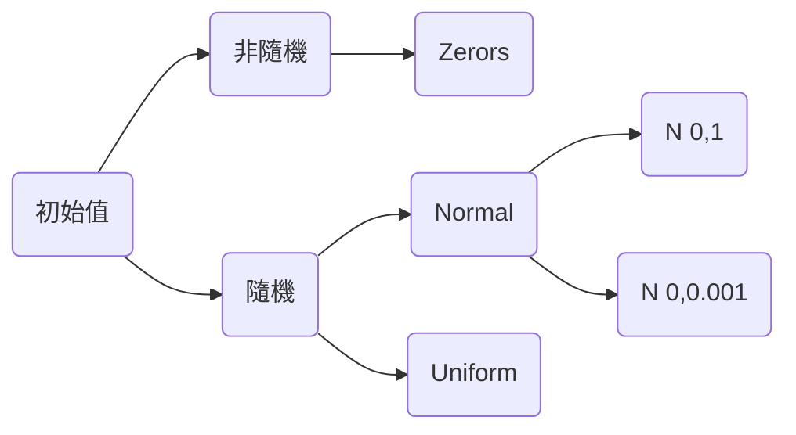

# Problem 1
> 經管碩二 0753732 陳弘承

## Description

Please read [this](https://github.com/Hong-CC/ECM9042_Deep_Learning/blob/main/Problem1/DL_HW1.pdf).

## Dataset

You can find the dataset [here](https://github.com/bat67/TibetanMNIST).

### i.
此小題使用的架構如下：

* 架構：[784,512,10]
* learning rate = 0.5。
* mini batch = 500。

|Training Error|Training Loss|Testing Error|
|:--------:|:--------:|:--------:|
||||

### ii.
此小題使用的架構如下：
* 架構：[784,512,10]
* 使用ADAM algorithm來最佳化深度學習的模型，所以learning rate = 0.001。
* mini batch = 500。

此小題要求使用zeros與random兩種不同的初始值方式，架構如下，在隨機的部分特別選用兩種(常態與均勻分配)老師上課解紹過機率分配來給初始值：

其中Normal有平均數為0，變異數為0.001、與變異數為1兩種，而Uniform的範圍則介於$\frac{-1}{\sqrt{784}} \sim \frac{1}{\sqrt{784}}$以下分別展示Training error、Testing error、Training loss

|Training error|Testing error|Training loss|
|:-------:|:--------:|:-----:|
|  |  |  |
> 先說結論：從我設計的四種種不同的初始化方式來看，共同的特點是平均數都是0，而初始值較好的設計方式為，變異數最好不要太大，盡可能讓初始值每個數值出現的機會都一樣大。其中出現的機會，指的是像均勻分配，平均而言每個數值出現的機率是一樣的，不像常態分配，離0越遠的數字，出現的機率較低。

這一題最明顯可以看到的地方是，如果假設初始值為0，三張圖的線都沒有往下降的狀態，因為如果所有的參數的初始值都是0，計算feed forward時，會讓所有的輸出層都一樣，近一步導致計算gradient descent時，所有的權重調整的方向都相同，達不到任何針對loss function調整權重的效果，最終的結果就會像是圖顯示的那樣。
所以比較好的方式是，針對初始值，應該給一些隨機的數字，在第一次計算feed forward時能給出差異，讓backpropagation能夠計算出不同的gradient descent針對loss function進行調整，所以進一步觀察，可以發現Normal(0,0.001)與Uniform分配的效果都比Normal(0,1)要好，像是training error與testing error分別在第50個與第100個epoch後，Normal(0,1)才看不出與其他兩種方式有太明顯的差異，以testing error為例Normal(0,1)與Uniform兩種方法在第40個epoch的時候，error rate就已經來到0.03左右，但Normal(0,1)在第40個epoch時error rate還高達0.1，一直到跑完250個epcoch，Normal(0,1)的error rate還是只有0.04，不像其他兩種隨機方法可以將錯誤率降到0.02。
至於在training loss的部分很可惜在我寫的程式裡面，Normal(0,1)前5次training loss的計算值太大，在python裡面顯示為inf，然後約莫一直到第10次前的值也都很大，無法一起畫在圖上顯示，推測是剛開始的幾筆資料預測的狀況太差，導致計算出來的數字太大，但其他兩種不同的隨機初始值方法的表現差不多，都能很快速的降低training loss，只是在100到200次epoch之間，還有點浮動，第200epoch後看起來才比較平穩。

### iii.
#### (1)
沒有Adam版本

| 20 epoch |80 epoch|
|:--------:|:--------:|
|||

有Adam版本

|20 epoch|80 epoch|
|:-----:|:-------:|
|  |  |
(2)
此小題使用的架構如下：
* 架構：[784,512,2,10]。
* 初始值為：Normal(0, 0.001)。
* 使用ADAM algorithm來最佳化深度學習的模型，所以learning rate = 0.001。
* mini batch = 500。
* 為了容易閱讀，只從testing data挑選前2000筆資料出來繪圖。

這邊有嘗試不使用Adam只用最基本的SGD，但表現出來的結果沒那麼好，所以額外手刻了Adam algorithm在我的程式裡面。

Adam algorithm是對SGD算出來的gradient descent進行調整，讓計算變得更穩定，提供報告另一個比較的標的。簡單介紹Adam，Adam融合了Momentum和RMSprop兩種不同的算法，Momentum比較像物理上的慣性，讓參數更新時會考慮前一次參數更新的方向，RMSprop則是針對learning rate依據梯度大小進行增強或減弱，在參數的設定上跟隨adam的作者還有老師的講義，$\rho_1 = 0.9$、$\rho_2=0.999$、$\epsilon=0.001$

左邊的圖為訓練20個epoch的結果，雖然大部分的結果都集中在一條看起來很像一次線性函數的直線上，但仔細看還是能看出比較小的數字，如0、1、2大約都集中在圖形的左下角，而較大的數字，如7、8、9都集中在圖形的右上角，當我們訓練到80 epoch的時候大概也可以看出類似的規則，數字小的在左下方，數字大的在右上方，只是數字較小的這些在y軸的方向分得比較開了，但右上角的那些數字比較大的資料，在判斷上可能會比較差，整體來說，利用這樣的架構，在2D feature上大致可以猜測資料先往x軸的方向排列，小的在左邊，大的在右邊，接著再往y軸的方向上下擴張。
### iv.

利用三層[784,512,10]的架構，加上ADAM algorithm，針對test data的預測accuract rate為96.56%，大致上來說都能預測正確，但是2跟3、4跟9電腦貌似判斷得不夠好，主要的錯誤都出現在這兩組數字的預測，另外數字4也比較容易被誤判為其他數字。
出於好奇，我隨機從資料內挑出2、3、4、9這四個數字：
| 2 | 3 |
| -------- | -------- |
|||

| 4 | 9 |
| -------- | -------- |
| ||
確實從人眼判斷，也會覺得2、3，4、9這兩組數字長得確實蠻像的。

---
###### 
